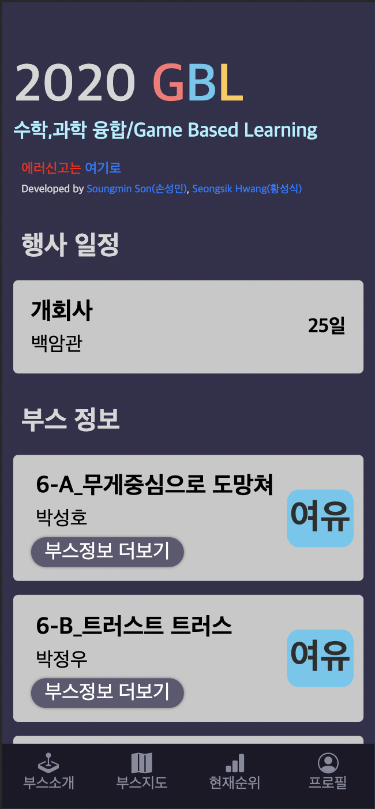
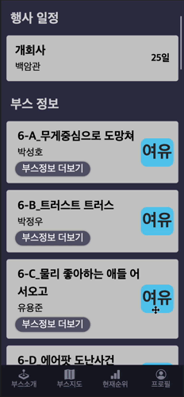
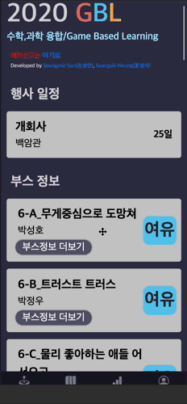
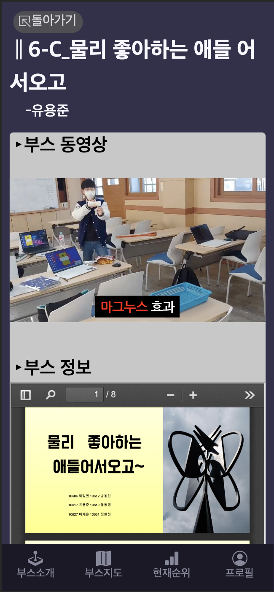
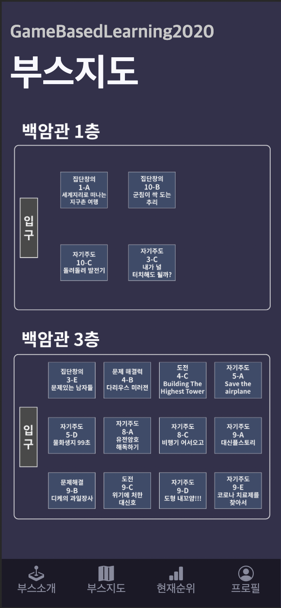
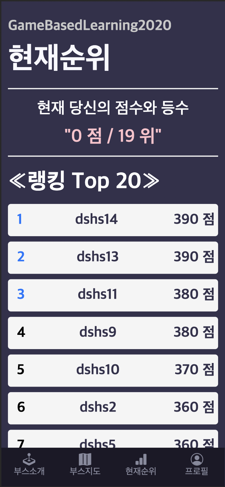
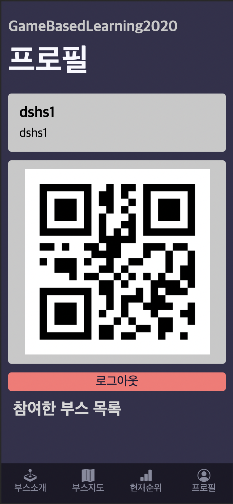

# GBL웹애플리케이션
## Introduction

대전대신고등학교의 행사 GBL(*Game Based Learning*)에 사용되는 웹애플리케이션입니다. 행사 참여자의 점수 관리, 부스 정보 공유를 위해 기획되었으며 행사 특성상 모바일 환경에 최적화하여 제작했습니다.

## Home

행사 일정, 부스의 간단한 정보와 혼잡도를 바로 확인하실 수 있으며, 밑으로 스크롤시 모든 부스를 확인하실 수 있습니다.

 

### 1) Booth details

"부스정보 더보기" 버튼을 통해 들어가실 수 있는 화면입니다. 부스 동영상, 부스 정보(부스 소개)를 확인하실 수 있습니다.

 

## Map

부스의 위치와 행사 장소의 구조를 파악하실 수 있습니다.

## Ranking

전체 랭킹 중 자신의 현재 순위와 TOP20을 바로 확인할 수 있는 페이지입니다. 1, 2, 3등은 파란색으로 표시됩니다.

## Profile

자신의 프로필을 확인할 수 있는 페이지 입니다. 자신의 아이디, 부스 체험에 필요한 QR코드, 자신이 참여한 부스 목록을 확인하실 수 있습니다.

## Erorr report
에러신고 : [Report Error](https://open.kakao.com/o/sUtgitHc)
